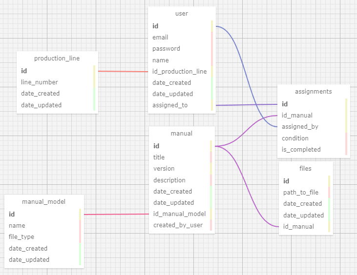

# Modelagem_banco_de_dados

1- production_line - user (1 - N):
A tabela 'user' possui uma chave estrangeira 'id_production_line', que recebe o identificador da linha. Isso permite identificar em qual linha um funcionário trabalha.

2- user - manual (N - N):
Existe uma relação entre as tabelas 'user' e 'manual' para definir a atribuição de tarefas. Isso requer uma tabela intermediária chamada 'assignments', que registra o identificador do usuário responsável pela tarefa, quem atribuiu a tarefa e o manual atribuído.

3- manual_model - manual (1 - N):
Na tabela 'manual', há uma chave estrangeira 'id_manual_model' para identificar o modelo de equipamento associado a cada manual.

4- manual - files (1 - N):
A tabela 'files' possui uma chave estrangeira 'id_manual' para identificar os arquivos relacionados a cada manual.

